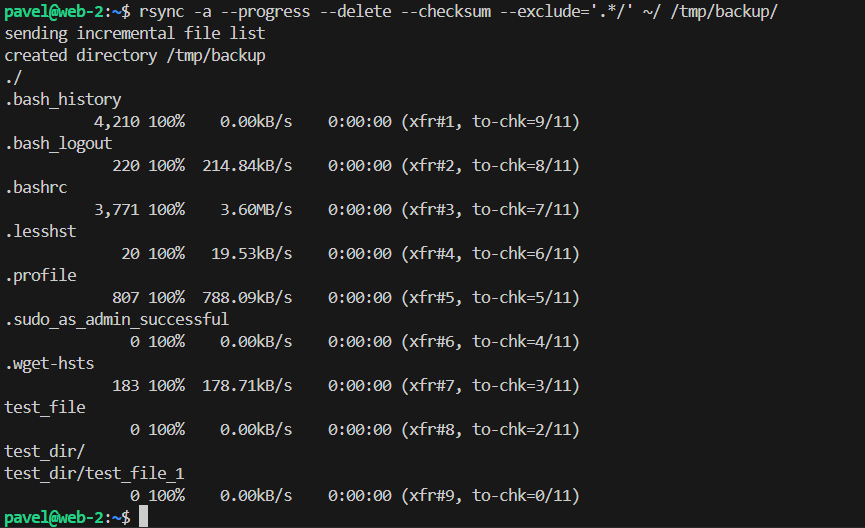
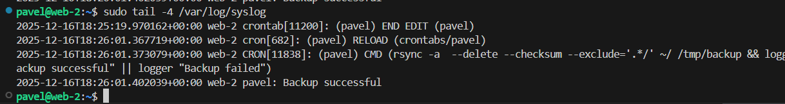
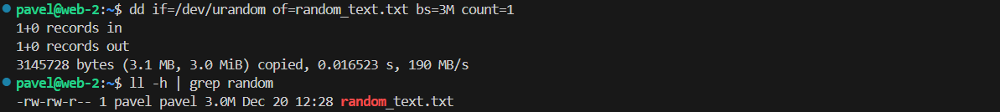
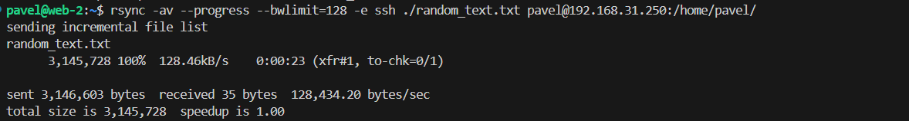
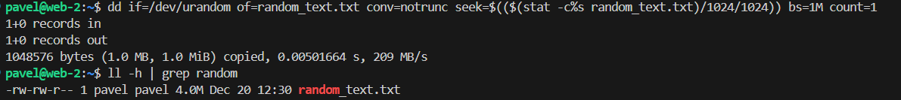
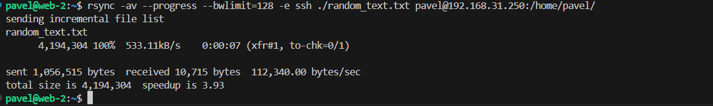

# Домашнее задание к занятию "`Резервное копирование`" - `Рыбянцев Павел`


------

### Задание 1
- Составьте команду rsync, которая позволяет создавать зеркальную копию домашней директории пользователя в директорию `/tmp/backup`
- Необходимо исключить из синхронизации все директории, начинающиеся с точки (скрытые)
- Необходимо сделать так, чтобы rsync подсчитывал хэш-суммы для всех файлов, даже если их время модификации и размер идентичны в источнике и приемнике.
- На проверку направить скриншот с командой и результатом ее выполнения
```
оставил в результатах выполнения скрытые файлы, так как в задании говорится только об исключении скрытых каталогов
```



### Задание 2
- Написать скрипт и настроить задачу на регулярное резервное копирование домашней директории пользователя с помощью rsync и cron.
- Резервная копия должна быть полностью зеркальной
- Резервная копия должна создаваться раз в день, в системном логе должна появляться запись об успешном или неуспешном выполнении операции
- Резервная копия размещается локально, в директории `/tmp/backup`
- На проверку направить файл crontab и скриншот с результатом работы утилиты.

[cron](cron)


---

## Задания со звёздочкой*
Эти задания дополнительные. Их можно не выполнять. На зачёт это не повлияет. Вы можете их выполнить, если хотите глубже разобраться в материале.

---

### Задание 3*
- Настройте ограничение на используемую пропускную способность rsync до 1 Мбит/c
- Проверьте настройку, синхронизируя большой файл между двумя серверами
- На проверку направьте команду и результат ее выполнения в виде скриншота

```
Поскольку нам нужно ограничить скорость до 1 мегабита в секунду (Мбит/с), перевожу единицы измерения:
1 Мбит/с = 128 KBps
Таким образом ограничиваю пропускную способность (--bwlimit=128)
```
```
rsync -av --progress --bwlimit=128 -e ssh ./random_text.txt pavel@192.168.31.250:/home/pavel/
```
```
создал текстовый файл с рандомным содержимым размером 3MB
```

```
Синхронизировал его на удаленный хост
```

```
Дописал в конец файла еще 1 МБ рандомных данных
```

```
Синхронизирую файл на удаленном хосте, вижу что дописался всего 1МБ а не все 4 МБ
```



------